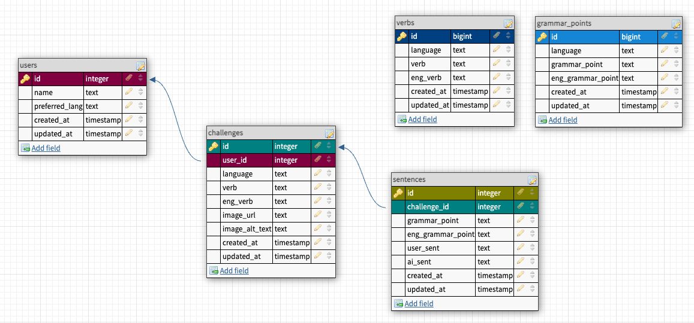

<!-- ReadMe -->

<!-- Opening -->
 

  <!--  -->

<h3 align="center">A.L.P.s</h3>
  <h1 align="center">Advanced Language Practices</h1>
    

      Improve your language skills with immediate feedback & inspired regular practice!
      

      We've "climbed the mountain" of learning another language but to keep our skills fresh we need to regularly practice them! Language output (speaking & writing) is key yet writing everyday can get dull and you might never know if it's completely correct or not. With A.L.P.s, every writing challenge comes with a theme image for inspiration, grammar points and verbs to practice in your target language, AND immediate feedback with the help of AI!
    

 

<!-- TABLE OF CONTENTS -->

  
Table of Contents

  <ol>
    <li>
      <a href="#about-the-project">About The Project</a>
      <ul>
        <li><a href="#built-with">Built With</a></li>
      </ul>
    </li>
    <li>
      <a href="#getting-started">Getting Started</a>
      <ul>
        <li><a href="#prerequisites">Prerequisites</a></li>
        <li><a href="#schema">Schema</a></li>
        <li><a href="#testing">Testing</a></li>
      </ul>
    </li>
    <li><a href="#endpoints">Endpoints</a></li>
    <li><a href="#apis">APIs Used</a></li>
    <li><a href="#technologies">Other Technologies Used</a></li>
    <li><a href="#contact">Contributors</a></li>
    <li><a href="#refactor">Future Iterations</a></li>
  </ol>

 

<!-- ABOUT THE PROJECT -->
## About The Project

   ☀️ [Production Website] (add link here)
    
   ☀️ [Backend Service](https://git.heroku.com/calm-thicket-75558.git)
    
   ☀️ [Front End Repository] (add link here)
    
   <!-- * [Video Presentation]() -->

  **A.L.P.s** was created by a cross-functional development team of students from the Turing School of Software and Design as their [capstone project](https://mod4.turing.edu/projects/capstone/).

  The mission of**A.L.P.s** is to provide users with writing promts that ignite their imagination and immediate feedback on their language output.

  <!--Users simply click the "Find a Random Act of Kindness" button and are presented with 3 random acts to choose from. Once chosen, they schedule the "good deed" and it gets added to their dashboard. Users are able to invite others to join in on the fun as well as add it to their calendars because, let's be real, life can get hectic.

  For visitors who aren't ready to jump into completing an act, they can browse our library of kind act photos for the feel-goods. -->

(<a href="#readme-top">back to top</a>)

<!-- Built With -->
### Phase 1: Built With

 
 

<!--  -->

### Phase 2: Built With
 
 

<!-- 

 -->

(<a href="#readme-top">back to top</a>)

<!-- GETTING STARTED -->
## Getting Started

If you'd like to demo this API on your local machine:
1. Ensure you have the prerequisites
2. Sign up for external API Keys
2. Clone this repo: `git clone git@github.com:A-L-P-s/ALPs_api.git`
3. Navigate to the root folder: `cd ALPs_api`
4. Run: `bundle install`
5. Run: `rails db:{create,migrate,seed}`
6. Run: `bundle exec figaro install`
7. In the `app/config/application.yml` file add you API keys:
  - `UNSPLASH_API_KEY: add_api_key_here`
  - `OPENAI_API_KEY: add_api_key_here`
8. Inspect the `/db/schema.rb` and compare to the 'Schema' section below to ensure migration has been done successfully
9. Run: `rails s`
10. Visit http://localhost:3000/

<!-- Prerequisites -->
### Prerequisites

- Ruby Version 3.1.1
- Rails Version 7.0.4.x
- Bundler Version 2.4.9

<!-- External API keys -->
### External APIs

- Sign up for your individual external API keys:
- [Unsplash](https://unsplash.com/documentation#creating-a-developer-account)
    - Follow instructions provided.
- [OpenAI](https://platform.openai.com/overview)
    - Once you have signed up, click on your profile at the top left and selecting `View API keys`.
    - Then click `Create new secret key`.

<!-- Schema -->
### Schema

<!-- Testing -->
### Testing
To test the entire spec suite, run `bundle exec rspec`.
*All tests should be passing.*

Happy path, sad path, and edge testing were considered and tested. When a request cannot be completed, an error object is returned.

  
Error Object

    <pre>
    <code>
{
  "error": {
      "status": "404"
      "title": "Invalid Request",
      "detail": "Couldn't find User with 'id'=<id>"
     }
}
    </code>
  </pre>

(<a href="#readme-top">back to top</a>)

<!-- Endpoints -->
## Endpoints

  
<code>GET "/api/v1/users"</code>

  Response:
  <pre>
    <code>
{
  "data": [{
    "id": "55",
    "type": “user",
    "attributes": {
        "name": "Deniz",
        "preferred_lang": "Turkish",
        "challenges": null (or [])
    }},
    {
    "id": "1",
    "type": “user",
    "attributes": {
        "name": "Alexis",
        "preferred_lang": "Spanish",
        "challenges": null (or [])
      }
  }]
}
    </code>
  </pre>

  
<code>GET "/api/v1/users/:id"</code>

  Response:
  <pre>
    <code>
{
  "data": {
    "id": “55”,
    "type": “user",
    "attributes": {
        "name": "Deniz",
        "preferred_lang": "Turkish",
        "challenges": [
            {
              "challenge_id": "1", 
              "language": "Turkish", 
              "verb": "(i) gitmek",
              "eng_verb": "to go", 
              "image_url": "/random/unplash/image.url",
              "image_alt_text": "Plane flying over the Bosphorous", 
              "created_at": "05-30-2023"
            }, 
            { ...etc...}
        ]
     }  
   }
}
    </code>
  </pre>

  
<code>GET "/api/v1/users/:id/challenges/prompt"</code>

  Response:
  <pre>
    <code>
{
  "data": {
    "id": null,
    "type": “challenge",
    "attributes": {
        "language": "Turkish", 
        "verb": "(i) gitmek"
        "eng_verb": "to go" 
        "image_url": "/random/unplash/image.url"
        "image_alt_text": "Plane flying over the Bosphorous" 
        "created_at": null
        "grammar_points": [
           {
            "grammar_point": "geçmiş zaman"
            "eng_grammar_point": "past simple"
           },
           { ...etc...}
        ]
        "sentences": null
     }  
   }
}
    </code>
  </pre>

  
<code>POST "/api/v1/users/:id/challenges"</code>

  Request Body:
  <pre>
    <code>
{
 "language": "Turkish",
 "verb": "(i) gitmek",
 "eng_verb": "to go",
 "image_url": "/random/unplash/image.url",
 "image_alt_text": "Plane flying over the Bosphorous", 
 "sentences": [
   {
    "grammar_point": "geçmiş zaman",
    "eng_grammar_point": "past tense",
    "user_sent": "Dün havalimana gittik ama arkadaşım uçak gelmedi."
    },
    {
      "grammar_point": "geniş zaman",
      "eng_grammar_point": "future tense",
      "user_sent": "Dün havalimana gittik ama arkadaşım uçak gelmeyecek."
    }
  ]
}
    </code>
  </pre>

  Response:
  <pre>
    <code>
  {
  "data": {
    "id": “1”,
    "type": “challenge",
    "attributes": {
        "language": "Turkish", 
        "verb": "(i) gitmek",
        "eng_verb": "to go", 
        "image_url": "/random/unplash/image.url",
        "image_alt_text": "Plane flying over the Bosphorous", 
        "created_at": "05-30-2023",
        "grammar_points": null,
        "sentences": [
          {
           "sent_id": "1",
           "grammar_point": "geçmiş zaman",
           "eng_grammar_point": "past tense",
           "user_sent": "Dün havalimana gittik ama arkadaşım uçak gelmedi.",
           "ai_sent": "Dün havalimanına gittik, ancak arkadaşımızın uçağı gelmedi."
           }, 
           { ...etc...}     
         ]
     }  
   }
}
    </code>
  </pre>

  
<code>GET "/api/v1/users/:id/challenges/:challenge_id"</code>

  Response:
  <pre>
    <code>
{
  "data": {
    "id": “1”,
    "type": “challenge",
    "attributes": {
        "language": "Turkish", 
        "verb": "(i) gitmek",
        "eng_verb": "to go", 
        "image_url": "/random/unplash/image.url",
        "image_alt_text": "Plane flying over the Bosphorous", 
        "created_at": "05-30-2023",
        "grammar_points": null,
        "sentences": [
          {
           "sent_id": "1",
           "grammar_point": "geçmiş zaman",
           "eng_grammar_point": "past tense",
           "user_sent": "Dün havalimana gittik ama arkadaşım uçak gelmedi.",
           "ai_sent": "Dün havalimanına gittik, ancak arkadaşımızın uçağı gelmedi."
           }, 
           { ...etc...}     
         ]
     }  
   }
}
    </code>
  </pre>

  
<code>DELETE "/api/v1/users/:id/challenges/:challenge_id"</code>

  Response
  <pre>
    <code>
Status: 204
    </code>
  </pre>

 

View these endpoints in [Postman] (add link here)

(<a href="#readme-top">back to top</a>)

<!-- APIs Used -->
<h2 id="apis">APIs Used</h2>

[Unsplash API](https://unsplash.com/developers) was consumed to generate the random theme image for every writing challenge.

[OpenAI API](https://openai.com/product) was used to correct sentences and provide immediate feedback on user's langauge output.

(<a href="#readme-top">back to top</a>)

<!-- Other Technologies Used 
<h2 id="technologies">Other Technologies Used</h2>

[Google Cloud Platform](https://cloud.google.com/) was used to allow users to sign in with their Google account.

  
 <strong>Google OAuth</strong>
 
  
Signing in to the Do Good app is made simple by allowing users to sign in with Google. 

  
  More information on the gem used for this(`omniauth-google-oauth2`) can be found [here](https://github.com/zquestz/omniauth-google-oauth2)

 

[Amazon Web Services](https://aws.amazon.com/) was used to allow users to upload photos for their completed good deeds.

  
<strong>Amazon S3 Cloud Object Storage</strong>
 
  
By including amazon's web serfice for storage, we can allow users to upload their pictures which are then saved as objects in a "bucket".  

  More information on the gem used for this(`aws-sdk-s3`) can be found [here](https://github.com/aws/aws-sdk-ruby)

 

[Twilio SendGrid](https://sendgrid.com/) was used to send an email to the user after they create a good deed

  
<strong> Email Service</strong>
 
    
The host and attendees will receive an email upon the completion of a good deed.

 

(<a href="#readme-top">back to top</a>)

-->

<!-- Future Iterations 

<h2 id="refactor">Future Iterations</h2>

  
Rafactor/Changes

  <dl>
    <dt>Pull other APIs</dt>
      <dd>- Locally available volunteer opportunities</dd>
    <dt>Refactor Serializers</dt>
      <dd>- Specifcally the good deeds serializers</dd>
  </dl>

(<a href="#readme-top">back to top</a>)

<h2 id="contact">Contributors</h2>

|  |  |  |  |  |  |
| ------------------ | ------------ | -------------- | ----------- | -------------- | ----------- |
| Huy Phan | Jasmine Hamou | Kara Jones-Hofmann | Matt Enyeart | Melony Erin Franchini | Mike Dao |
| Collaborator | Collaborator | Collaborator | Collaborator | Collaborator | Project Manager |
| [GitHub](https://github.com/HuyPhan2025) | [GitHub](https://github.com/hamouj) | [GitHub](https://github.com/KaraJoHo) | [GitHub](https://github.com/menyeart) | [GitHub](https://github.com/MelTravelz) | [GitHub](https://github.com/mikedao) |
| [LinkedIn](https://www.linkedin.com/in/huy-phan-2471b3261/) |  [LinkedIn](https://www.linkedin.com/in/jasmine-hamou/) | [LinkedIn](https://www.linkedin.com/in/81012911-91208/) | [LinkedIn](https://www.linkedin.com/in/matt-enyeart/) | [LinkedIn](https://www.linkedin.com/in/melony-erin-franchini/) | [LinkedIn](https://www.linkedin.com/in/michaeldao/) |

(<a href="#readme-top">back to top</a>)

-->